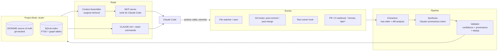
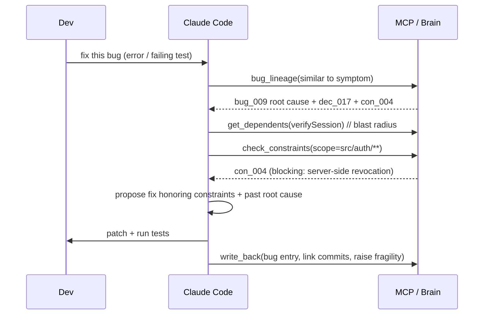

# Engineering Memory OS — System Design

> A persistent, structured engineering-memory layer over a codebase, executed through Claude Code.
> Local-first. Git-native. Designed to compound in value the longer it runs.

**Status:** Design spec (v0). No code yet.
**Audience:** Solo founder building with a Claude Code subscription.
**One-line pitch:** Git stores *what* the code is. We store *why* it is that way — and feed that back into every future AI reasoning step.

---

## 0. The thesis in one paragraph

Today's AI coding tools are **stateless**. Every session re-reads the code, re-derives understanding, then throws it away. The codebase itself is a lossy artifact: it records the final state, not the rejected alternatives, the bug that forced a weird workaround, the invariant you must never break, or the reason a module exists. That knowledge lives in people's heads and evaporates when they context-switch or quit. The Engineering Memory OS captures the **derived "why" layer** as a structured, queryable, continuously-updated knowledge graph — the *Project Brain* — and injects the minimal relevant slice into Claude Code at reasoning time. The longer a team uses it, the smarter it gets and the more expensive it is to leave.

---

## 1. Vision

### What it becomes in 3–5 years
- **The institutional memory of an engineering org.** When an engineer leaves, their knowledge doesn't. New hires "ask the codebase why" and get accurate, sourced answers.
- **A reasoning substrate, not a feature.** Every AI action (fix, refactor, review, plan) is grounded in accumulated decisions, bug history, and constraints — so the AI stops making the same mistakes and stops undoing intentional design.
- **The system of record for engineering intent.** ADRs, postmortems, tribal Slack threads, and "don't touch this" comments collapse into one structured, living graph that is generated as a byproduct of normal work — not extra documentation toil.
- **A trust layer for autonomous agents.** As agents take on more work, the bottleneck becomes *grounding and guardrails*. The Brain is the guardrail: constraints are enforced, blast radius is known, regressions are remembered.

### Why it's fundamentally different from Cursor / Copilot / autocomplete
| | Cursor / Copilot | Engineering Memory OS |
|---|---|---|
| Core data model | Ephemeral RAG over **current code** | Persistent, curated **knowledge graph** of decisions/bugs/constraints |
| Time horizon | This session | The lifetime of the codebase |
| What it indexes | Syntax + embeddings of files | *Why* — intent, causality, history, invariants |
| Write path | None (read-only over code) | First-class: it *learns* at commit/PR/test/bug events |
| Value over time | Flat (re-derived each time) | Compounds (flywheel) |
| Failure it removes | "AI can't see enough code" | "AI repeats past mistakes / breaks intentional design" |

The mental model: Copilot is a sharp contractor who reads the blueprints fresh each morning. This is the **building engineer who has been on-site for ten years** and remembers every pipe, every flood, and the reason that load-bearing wall can't move. We are not competing on retrieval; we are creating a new artifact (the curated reasoning graph) that doesn't exist today.

---

## 2. Core System Design

### 2.1 Components


1. **Ingestion / Watchers** — capture events: file saves (debounced), git hooks (`post-commit`, `post-merge`), test-run results, and (later, remote) PR/CI webhooks.
2. **Extractors** — deterministic, no-LLM: parse code with tree-sitter into a symbol/dependency graph; analyze commit diffs; compute churn/centrality metrics.
3. **Synthesis (LLM)** — Claude turns raw diffs/failures into *candidate* memory: "this commit introduced X because Y," "this looks like a recurrence of bug #42."
4. **Validator** — attaches confidence + provenance, dedups against existing memory, flags conflicts, decides advisory vs. write.
5. **Project Brain (store)** — JSON/Markdown files on disk are the **source of truth** (git-friendly, reviewable, diffable); a SQLite database is the **derived index** (fast queries, FTS5 search, graph via recursive CTEs).
6. **Context Assembler** — given a task, selects the *minimal relevant slice* of the Brain (not a context dump).
7. **Integration layer** — MCP server (structured two-way tools), auto-maintained `CLAUDE.md` (ambient context), and slash commands (user-triggered workflows).

### 2.2 Data flows
- **Write path (learning loop):** event → extractor → candidate delta → Claude synthesis → validator → write to JSON source of truth → reindex into SQLite.
- **Read path (reasoning loop):** user task in Claude Code → MCP tool call → context assembler retrieves relevant Brain slice → injected into prompt → Claude reasons + acts → action triggers the write path again.

### 2.3 Local vs. remote
- **Local (v1, the whole product for a solo dev):** file watchers, extractors, SQLite, MCP server, and the `.brain/` directory committed to the repo. **Team sync is free at v1** because the Brain lives in git — push/pull *is* the sync.
- **Remote (later, team/enterprise):** hosted sync service for merge/conflict resolution on the Brain, a web dashboard (architecture map, fragility heatmap), PR webhooks, org-wide cross-repo graph, SSO/audit. Nothing here is required to ship value to the first user.

---

## 3. "Project Brain" Specification

Stored under `.brain/` as JSON (machine source of truth) with optional Markdown mirrors for humans. SQLite mirrors everything for querying. Every record carries **provenance** (`source`, `confidence`, `evidence`) so nothing is a blind assertion.

### 3.1 Core entity types
- `Component` — architecture node (service / module / layer / external).
- `Edge` — typed relationship between components or symbols.
- `Symbol` — file/function-level node for the dependency map.
- `Decision` — an ADR-style record, auto-drafted and human-confirmable.
- `Bug` — a bug with root cause and lineage (introduced → fixed → recurred).
- `Constraint` — an invariant the system must respect.

### 3.2 Example JSON

**Component (architecture graph node)**
```json
{
  "id": "cmp_auth",
  "kind": "module",
  "name": "Auth",
  "responsibility": "Issue/verify sessions and enforce access control.",
  "paths": ["src/auth/**"],
  "status": "active",
  "owners": ["@nofar"],
  "fragility": 0.71,
  "provenance": { "source": "inferred", "confidence": 0.62, "evidence": ["src/auth/index.ts", "commit:a1b2c3d"] },
  "created_at": "2026-05-02T10:00:00Z",
  "updated_at": "2026-06-14T09:00:00Z"
}
```

**Edge (architecture / dependency relationship)**
```json
{
  "id": "edge_0192",
  "from": "cmp_billing",
  "to": "cmp_auth",
  "type": "depends_on",
  "reason": "Billing checks session scope before charging.",
  "strength": 0.9,
  "provenance": { "source": "extracted", "confidence": 0.98, "evidence": ["src/billing/charge.ts:imports src/auth/session.ts"] }
}
```

**Symbol (file/function dependency node)**
```json
{
  "id": "sym_session_verify",
  "file": "src/auth/session.ts",
  "name": "verifySession",
  "kind": "function",
  "signature_hash": "sha1:9f2c…",
  "calls": ["sym_jwt_decode", "sym_db_getUser"],
  "called_by": ["sym_billing_charge", "sym_api_middleware"],
  "metrics": { "loc": 48, "churn_90d": 14, "bug_count": 3, "fan_in": 11 },
  "last_changed": "commit:a1b2c3d"
}
```

**Decision (auto-drafted ADR)**
```json
{
  "id": "dec_017",
  "title": "Store sessions in Redis, not JWT-only",
  "status": "accepted",
  "context": "Stateless JWTs made forced logout impossible after a token leak (see bug_009).",
  "decision": "Sessions are server-side in Redis; JWT carries only an opaque session id.",
  "consequences": ["Adds Redis dependency", "Enables instant revocation"],
  "alternatives_rejected": ["Short-lived JWT + refresh (still no instant revoke)"],
  "related_components": ["cmp_auth"],
  "related_files": ["src/auth/session.ts"],
  "supersedes": null,
  "caused_by_bug": "bug_009",
  "commit": "a1b2c3d",
  "provenance": { "source": "llm_draft+human_confirmed", "confidence": 0.95 },
  "date": "2026-05-30T12:00:00Z"
}
```

**Bug (with lineage)**
```json
{
  "id": "bug_009",
  "title": "Leaked token usable after password reset",
  "symptom": "Old token still authenticated after user reset password.",
  "root_cause": "Stateless JWT could not be revoked server-side.",
  "severity": "critical",
  "status": "fixed",
  "affected_files": ["src/auth/session.ts"],
  "affected_symbols": ["sym_session_verify"],
  "lineage": {
    "introduced_commit": "f00ba12",
    "detected": "test:auth.revocation.spec.ts",
    "fixed_commit": "a1b2c3d",
    "recurrence_of": null,
    "spawned_decision": "dec_017",
    "spawned_constraint": "con_004"
  },
  "provenance": { "source": "test_failure+llm", "confidence": 0.88 }
}
```

**Constraint (invariant)**
```json
{
  "id": "con_004",
  "type": "security",
  "statement": "Session revocation must be server-side; never trust JWT expiry alone for logout.",
  "scope": ["src/auth/**"],
  "severity": "blocking",
  "enforcement": "advisory_v1",
  "rationale": "Derived from bug_009 / dec_017.",
  "source_decision": "dec_017",
  "violations": [],
  "provenance": { "source": "derived", "confidence": 0.9 }
}
```

### 3.3 How the pieces link
`Bug → spawns → Decision → spawns → Constraint`, and all three attach to `Components`, `Symbols`, and `commits`. This is what lets the agent answer "why" and "what must not break" with **evidence**, not vibes.

---

## 4. Continuous Learning Loop

The Brain updates itself from normal developer activity. **Zero extra documentation work** is the product requirement — if it needs babysitting, it dies (see §9).

| Trigger | Deterministic step (no LLM) | Synthesis step (Claude) | Written to Brain |
|---|---|---|---|
| **File changes** (save) | Re-parse changed files; update `Symbol` graph + metrics; detect if a constraint `scope` was touched | Only if change is significant | Updated symbols/edges; "constraint touched" flag |
| **Commit** (`post-commit`) | Diff analysis; map files→components | Summarize *what changed and why*; draft a `Decision` if intent is non-trivial | Decision draft (low-confidence until confirmed); component updates |
| **PR created** (later, remote) | Aggregate commits; parse "Fixes #N" | Risk note + refine decision; link to bug | Decision finalized; bug linked |
| **Tests fail** | Capture failing test + stack + recent diff; rank suspect symbols by `churn × recency × fan_in` | Draft `Bug` (symptom, suspected root cause); check similarity to past bugs → recurrence | Bug entry + lineage; possible regression `Constraint` |
| **Bug fixed** | Link `introduced→fixed` commits | Confirm root cause; propose `Constraint` to prevent recurrence | Bug status `fixed`; constraint draft |

### How knowledge evolves (not just accumulates)
- **Confidence + provenance on everything.** `inferred` < `llm_draft` < `human_confirmed`. Low-confidence items are advisory and cheap to discard.
- **Supersede, don't delete.** New decisions mark old ones `superseded` — history stays auditable.
- **Promotion.** A pattern that recurs (e.g., the same class of bug in one module) is *promoted* into a `Constraint` and raises that component's `fragility` score.
- **Decay + re-validation.** Inferred facts get a staleness timer; on the next relevant change they're re-checked or demoted.
- **Consolidation pass.** A periodic LLM "memory compaction" merges duplicates, summarizes verbose chains, and prunes dead nodes — keeping the Brain dense and cheap to retrieve.

---

## 5. Agent Workflow

The agent always follows: **retrieve relevant memory → reason with it → act → write back what was learned.**

### "Fix this bug"

The win: the agent **doesn't re-discover** the revocation lesson — it's grounded in `bug_009`/`con_004` from second one.

### "Refactor this module"
1. `get_component(cmp_auth)` + `get_edges` → dependents and dependencies (blast radius).
2. `get_decisions(cmp_auth)` → *why it's shaped this way* (so it won't undo intentional design like `dec_017`).
3. `check_constraints(src/auth/**)` → invariants to preserve.
4. Plan a refactor that preserves public contracts + invariants; execute; run tests.
5. `record_decision(...)` capturing the new structure and rationale.

### "Why is this system fragile?"
1. Rank nodes by `fragility = f(churn, bug_count, fan_in, test_coverage_gap)`.
2. `bug_lineage` clustered by component → where do incidents concentrate?
3. `check_constraints` → which invariants are most-violated / advisory-only?
4. Synthesize a **fragility report with evidence**: specific files/functions, the bug history behind them, and missing guards — not a generic lecture.

---

## 6. MVP Plan (1–2 weeks)

**Cut to the bone. The first killer feature:** *persistent decision + bug memory, auto-captured from git commits, queryable by Claude Code via MCP, plus an auto-generated architecture map.*

### Day-1 "aha"
Make a commit → the Brain captures a structured `Decision` and updates the architecture map → in the next Claude Code session ask *"why does the Auth module store sessions in Redis?"* and it answers from memory, with the commit as evidence.

### MVP scope
- `.brain/` directory in the repo (git-tracked JSON + Markdown mirrors).
- **CLI** (`brain`): init, index, sync-on-commit, query, why, fragile.
- **MCP server** exposing read/write tools to Claude Code.
- **SQLite index** (FTS5 search; graph via recursive CTEs) over the JSON source of truth.
- Auto-maintained **`CLAUDE.md`** (pointer + top constraints) and a **git `post-commit` hook**.
- **Defer:** embeddings/vector search, PR webhooks, web dashboard, team sync, multi-repo.

### Folder structure
```
brain/
├─ .brain/                      # source of truth (committed)
│  ├─ components/*.json
│  ├─ decisions/*.json
│  ├─ bugs/*.json
│  ├─ constraints/*.json
│  ├─ symbols/index.json
│  └─ brain.sqlite              # derived index (gitignored)
├─ src/
│  ├─ cli/                      # commander entrypoints
│  ├─ extractors/              # tree-sitter parsing, diff analysis, metrics
│  ├─ synthesis/               # Claude calls (commit→decision, fail→bug)
│  ├─ store/                   # JSON <-> SQLite, schema, queries
│  ├─ mcp/                     # MCP server + tool defs
│  └─ integrations/            # git hooks, CLAUDE.md writer
├─ .claude/commands/          # /brain-why, /brain-fix slash commands
├─ .mcp.json                  # registers the MCP server with Claude Code
└─ CLAUDE.md                  # auto-maintained ambient context
```

### CLI commands
```bash
brain init                 # scaffold .brain/, install post-commit hook, write .mcp.json + CLAUDE.md
brain index                # parse repo -> symbol/dependency graph + components (no LLM)
brain backfill --since 90d # replay git history -> seed decisions/bugs (cold-start fix)
brain sync                 # run by post-commit hook: diff -> Claude -> decision/bug write-back
brain query "<question>"   # FTS + graph query over the Brain
brain why <path|symbol>    # decisions/bugs/constraints explaining a file or function
brain fragile              # ranked fragility report with evidence
brain mcp                  # start the MCP server (Claude Code connects here)
```

### Simplest possible memory system
JSON file per entity (human-reviewable in PRs) + a SQLite mirror rebuilt by `brain index`. **No vector DB at MVP** — SQLite FTS5 covers search; add `sqlite-vec` embeddings only when keyword search proves insufficient. Graph queries use recursive CTEs over `edges`/`symbols` tables.

### Build order (so there's a usable artifact every couple of days)
1. `brain init` + `.brain/` schema + SQLite store.
2. `brain index` (tree-sitter → symbols/edges/components) → `brain why` works locally.
3. MCP server with `brain_query` / `brain_why` → Claude Code can read the Brain. **First end-to-end value.**
4. `post-commit` hook → `brain sync` → Claude drafts `Decision`. **The learning loop is alive.**
5. `brain backfill` (history seed) + `brain fragile` + write-back of bugs from test failures.

---

## 7. Technical Stack

| Layer | Choice | Why |
|---|---|---|
| Runtime | **Node 20 + TypeScript** | Cleanest path to MCP + VS Code; one language end-to-end. |
| CLI | `commander` (or `clipanion`) | Minimal, well-trodden. |
| Parsing | **tree-sitter** (`web-tree-sitter`) | Multi-language symbol/dependency extraction without per-language LSP wrangling. |
| Storage (truth) | **JSON/Markdown in `.brain/`** | Git-native, diffable, reviewable, free team sync via push/pull. |
| Storage (index) | **SQLite** (`better-sqlite3`) + **FTS5** | Fast queries, full-text search, graph via recursive CTEs. Add `sqlite-vec` later for embeddings. |
| Synthesis (write path) | **Anthropic SDK** *or* `claude -p` headless | Runs through the existing Claude Code subscription; keep LLM calls on the write path, not every read. |
| **Integration (decided)** | **MCP server + auto-maintained `CLAUDE.md` + slash commands** | See below. |
| VS Code | Works **through the Claude Code extension chat** (honors MCP + CLAUDE.md). Optional thin extension later for a Brain visualizer. |

### Integration decision (you asked me to choose) — and why
Use **all three layers**, because they serve different moments:
1. **MCP server** — the structured, two-way API. Claude can *query* the Brain (`brain_query`, `brain_why`, `bug_lineage`, `check_constraints`, `get_dependents`) **and write back** (`record_decision`). This is the "OS syscall" layer and the real product surface. Registered via `.mcp.json` / `claude mcp add`.
2. **`CLAUDE.md`** — *ambient* context loaded every session for free. Auto-maintained to hold a pointer to the Brain + the top blocking constraints, so even a naive prompt is grounded.
3. **Slash commands** (`.claude/commands/brain-why.md`, `brain-fix.md`) — *user-triggered* ergonomics for the common workflows from §5.

Layering = **ambient (CLAUDE.md) + on-demand structured (MCP) + user-triggered (slash)**. MCP alone misses always-on grounding; CLAUDE.md alone can't do structured queries or write-back. Together they cover every entry point into Claude Code, which is exactly what an "OS" should do.

---

## 8. Moat / Startup Strategy

### Why this can compound into a unicorn
- **A new proprietary data asset.** The customer owns their code; nobody owns the *curated reasoning graph* — because it doesn't exist today. We create it, and it lives where the work happens.
- **Compounding flywheel.** Every bug, decision, and refactor enriches the graph → better grounding → better AI actions → more captured intent → repeat. Value grows super-linearly with usage while competitors' RAG value stays flat.
- **High, *earned* switching cost.** After a year, the Brain encodes months of reasoning. Leaving means going blind again. The lock-in is value the customer built, not a contractual trap.
- **Org network effect.** A team Brain gets more valuable as more engineers contribute and as engineers leave (their knowledge persists). Cross-repo graphs compound at the org level.

### Why incumbents will struggle to copy it
- **Different data model + write path.** Copilot/Cursor are architected around *stateless retrieval over code at edit time*. Capturing *why* requires being in the loop at **commit / PR / test / bug** time and maintaining a curated graph — a different product and a different pipeline, not a feature toggle.
- **Misaligned incentives.** Token/seat-metered incumbents don't win by shrinking context with surgical memory; we do.
- **Trust wedge.** Local-first + git-native + visible provenance is a privacy/trust position cloud incumbents can't easily match.

### GTM
Solo-dev / OSS wedge (free local core) → bottoms-up team adoption (paid sync + dashboard + fragility heatmaps) → enterprise ("institutional memory," onboarding compression, compliance/audit, knowledge retention through turnover). The enterprise line — *"your engineering knowledge survives people quitting"* — is the budget-unlocking story.

---

## 9. Brutal Risks

- **Garbage-in memory poisons reasoning.** Bad LLM summaries compound into confidently-wrong "facts." → Mitigate with confidence + provenance, human-confirm for high-stakes items, and cheap-to-discard advisory tiers.
- **Staleness kills trust.** If the Brain drifts from reality, devs stop believing it and abandon it. → Auto-update must be near-zero-effort and self-healing; show "last verified" + evidence on every claim.
- **Maintenance toil is fatal.** The moment this feels like writing docs, it's dead. → Capture must be a *byproduct* of commits/tests, never a separate chore.
- **Token economics.** Injecting memory into every prompt is expensive and pollutes context. → Retrieval must be surgical (the Context Assembler is core, not optional).
- **"Just use ADRs / comments / git" objection.** Free alternatives exist. → We must be *dramatically* better and effortless, or we're a vitamin, not a painkiller.
- **Incumbent fast-follow.** Anthropic/Cursor could ship "memory." → Defense is speed, schema depth, git-native trust, and the compounding head start — but this is a real, ongoing threat.
- **Cold start.** An empty Brain delivers no day-1 value. → `brain backfill` over git history must produce a useful Brain on install.
- **Trust of auto-generated facts.** Engineers distrust machine assertions. → Always show provenance + make every record one-keystroke correctable.
- **Hard CS problems where current AI is *not* enough.** Reliable causal root-cause attribution, accurate fragility inference, and dedup/consolidation at scale are genuinely unsolved. Over-promising here breaks trust fast. → Frame outputs as *evidence-backed hypotheses*, keep the human in the loop, and let confidence be visible.
- **Scale + heterogeneity.** Huge monorepos, many languages, generated code, and merge conflicts on the Brain itself. → Start single-repo/local; design the schema to be mergeable from day one.

---

## Appendix A — MCP tool surface (v1)
```
brain_query(query: string)                 -> ranked records (FTS + graph)
brain_why(target: path|symbol)             -> decisions/bugs/constraints for target
brain_bug_lineage(symptom|symbol)          -> matching bugs + introduced/fixed/recurrence
brain_check_constraints(scope: glob)       -> constraints in scope + violations
brain_get_dependents(symbol)               -> blast radius (callers, dependent components)
brain_record_decision(decision: Decision)  -> write-back (confidence + provenance)
```

## Appendix B — Definition of done for the MVP
A developer runs `brain init` on a real repo, makes one commit, opens Claude Code, asks *"why is this module built this way?"*, and gets a correct, **evidence-cited** answer drawn from the Brain — with zero manual documentation written.
