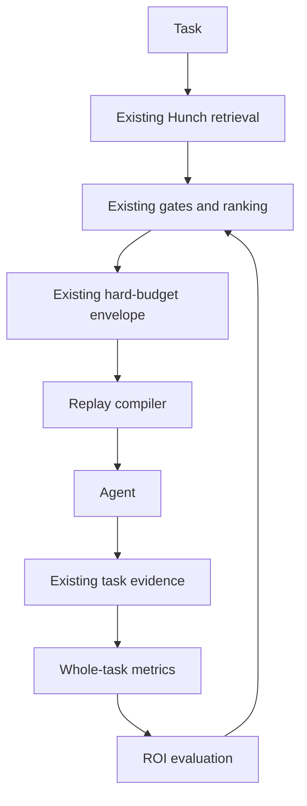

# Hunch Context Efficiency — Completion Plan

**Status:** Implementation-ready after final preflight review, against Hunch `1.42.0`  
**Audited revision:** `davesheffer/hunch` `main` at `5ff071a4997a2275d81db118c81425da5c572d94`  
**Updated:** 2026-09-27  
**Estimated POC:** 2–4 focused development days; benchmark collection time depends on the selected host and model limits

## 1. Corrected product decision

Do **not** build a second memory engine beside Hunch.

The current repository already contains most of the proposed context-efficiency foundation:

- hard context budgets;
- confidence and relevance abstention;
- bounded delivery envelopes;
- deterministic task-history ranking;
- outcome-aware ranking and supersession;
- same-session delta delivery;
- delivery receipts with per-record token estimates;
- task evidence linking delivery, application, verification and conformance;
- a footprint command and regression ceilings;
- a ranker benchmark with an automatic fallback to the baseline.

The product gap is narrower:

> Hunch does not yet prove how many total tokens, tool calls and seconds a complete task saved, and it does not yet reuse a verified outcome strongly enough to skip repeated investigation.

The next slice should extend the existing engine with:

1. **End-to-end task benchmarking.**
2. **Verified Outcome Replay.**
3. **ROI-driven delivery suppression and forgetting recommendations.**

The product claim to test remains:

> Hunch helps agents repeat less work while preserving task quality.

## 2. What already exists

This table is the implementation baseline. Do not rebuild these mechanisms.

| Capability | Current state | Existing implementation |
| --- | --- | --- |
| Hard token budget | Shipped | `src/core/delivery.ts` |
| Abstention | Shipped | Low-confidence, insufficient-context and low-relevance candidates are withheld |
| Bounded context assembly | Shipped | `HunchStore.assembleContext()` and `buildDeliveryEnvelope()` |
| Retrieval ranking | Shipped | `src/core/taskRanking.ts`, store search and graph ranking |
| Outcome-aware task ranking | Shipped | Failed/passed checks, conformance, saved memory and verified outcomes affect rank |
| Task supersession | Shipped | A newer passing task can suppress older task records |
| Same-session delta delivery | Shipped | `src/core/hookcache.ts` and stable delivery identity projection |
| Delivery telemetry | Shipped | `.hunch-cache/served.db`, rank, reason, provenance and token cost |
| Application and verification evidence | Shipped | Task reports distinguish delivered, agent-applied, rule-supported and checked |
| Context footprint measurement | Shipped | `hunch footprint`, `src/core/footprint.ts` and regression ceilings |
| Ranker evaluation | Shipped | Leave-one-out Hit@5/MRR comparison with automatic baseline fallback |
| Whole-task token and time savings | Missing | This plan adds it |
| Verified outcome reuse that skips investigation | Partial | Task records exist and rank, but are not compiled into a replay packet |
| ROI-driven forgetting | Partial | Receipts and applications exist, but do not yet control delivery from measured value |

### Audit verification

The targeted audit suite passed **65 of 65 tests**, covering delivery budgets, abstention, delta injection, task ranking, outcome evidence, receipts, task reports, cache behavior and footprint ceilings.

Measured on `src/mcp/server.ts` at the audited revision:

| Surface | Estimated tokens |
| --- | ---: |
| MCP tool list, audited repository profile | 10,870 |
| MCP tool list without output schemas | 8,637 |
| `hunch_context`, budget 1,500 | 1,434 |
| Generated grounding block | 925 |
| Prompt reminder | 82 |
| Task instruction | 202 |
| Compact task instruction | 95 |
| Task start result | 281 |
| Task finish result | 142 |

These are `characters / 4` estimates, not provider billing tokens. Tool-schema exposure is host-dependent: some hosts defer schemas while others may place them in model context. The figures show that the local delivery budget works; they do not prove whole-task savings. The fixed session footprint must be included because it may erase savings from smaller context calls.

### Review gaps closed in this revision

| Gap found during review | Required correction |
| --- | --- |
| A no-Hunch arm could still read generated Hunch instructions | Run each arm in an isolated worktree and session; remove only generated Hunch surfaces or use a tested harness-level disable switch |
| Existing task records may not contain a reusable cause/fix summary | Replay only stored evidence; add an explicit, provenance-bearing outcome summary only if the sparse packet is insufficient |
| A repository-wide source snapshot is too coarse for exact replay | Bind exact replay to fingerprints of the relevant files, record revisions and validation command |
| Delivery and a passing test do not prove Hunch caused success | Treat ROI as a delivery-value proxy and keep causal language out of reports |
| One run per arm is too noisy for agent work | Use fresh sessions and at least two paired repetitions per task; report variance |
| An arbitrary quality number can hide judgment | Bind quality to a named deterministic validator or a preregistered rubric hash |
| A run can contaminate later arms by writing new memory | Freeze the input memory snapshot per task and isolate all arm outputs; no arm may read another arm's writes |
| Tasks, validators or arm order can drift during the experiment | Preregister and hash the suite, validators, harness revision and arm-order seed before the first timed run |
| The ROI threshold requires seven days of evidence but the POC is four days | Validate ROI logic with fixtures or frozen historical receipts; make live suppression claims only after the real observation window is satisfied |
| A global no-Hunch switch could become an unsafe product bypass | Keep disablement inside the benchmark harness and isolated process configuration; do not add a production runtime bypass |
| Hunch's deterministic synthesis fallback cannot complete coding tasks | Use it only for harness fixtures; Gate A requires an available, authenticated coding-assistant subscription CLI |
| A harness added to Hunch can accidentally benchmark its own modified checkout | Run a controller revision outside the target worktrees and record both controller and target revisions |
| “Wall-clock time” is ambiguous if validation runs after the agent exits | Record agent time, validation time and total spawn-through-validation time separately |
| Replay delivery is not yet linked to the later check | Add a bounded replay-outcome receipt; count a value signal only when delivery and validation are joined by task ID |

### Start here — three gated decisions

Implementation must proceed in this order:

1. **Gate A — Measurement validity.** The two-arm baseline runs reproducibly with a real subscription CLI, the no-Hunch proof is clean and unavailable metrics remain unavailable.
2. **Gate B — Replay value.** Only after Gate A passes, add replay and prove that it reduces repeated investigation without a quality regression or stale exact reuse.
3. **Gate C — Suppression evidence.** Only after Gate B passes, evaluate ROI suppression. Fixtures can validate the algorithm, but only eligible real observations can support a product claim.

If a gate fails, stop and fix that gate. Do not continue merely to complete the four-day schedule.

## 3. The three missing capabilities

### 3.1 End-to-end task benchmark

Hunch currently measures its own context surfaces. The new benchmark must measure the complete task as a cost vector; do not add unlike units into one synthetic number:

```text
task cost includes:
  model input tokens
  model output tokens
  Hunch context-token estimate
  memory-processing tokens
  model calls
  tool calls
  agent, validation and total wall-clock time
```

The first experiment must have three arms:

1. **No Hunch** — the selected coding agent runs without Hunch context.
2. **Current Hunch** — unmodified Hunch 1.42.0 product behavior, observed by the external controller.
3. **Optimized Hunch** — current Hunch plus replay and only real-data-eligible ROI suppression; replay-only when ROI data is insufficient.

This separation matters. It shows both the value Hunch already provides and the incremental value of the new work.

Use the same:

- repository commit;
- task wording;
- explicitly selected coding-assistant subscription CLI;
- model and settings;
- validation command;
- cache state classification;
- time limit.

Every arm must use a fresh agent session and an isolated worktree. Snapshot the Hunch memory revision separately from the code revision. Freeze that input snapshot for the full paired comparison, and route task reports, caches and new memory writes to arm-specific disposable locations. No arm may read artifacts produced by another arm. Run at least two paired repetitions per task and alternate arm order from a preregistered seed.

The benchmark command is the **controller**. It must run from its own clean checkout/revision and create target worktrees at the declared repository revision. Never copy the controller's uncommitted source into a target arm. Record both revisions. This allows a newly added harness to measure the audited Hunch behavior without silently including unrelated product changes.

Before the first timed run, freeze and hash:

- the task-suite file;
- every validator command or rubric;
- the benchmark harness revision;
- each task's repository starting revision and cutoff-bounded Hunch memory revision;
- the arm-order seed.

Changing any of these creates a new experiment version; do not merge results across versions.

#### Baseline isolation

The `no-hunch` arm must disable all Hunch influence, not only `hunch_context`:

- no Hunch MCP tools or tool schemas;
- no prompt, session-start or pre-edit hooks;
- no generated Hunch section in `AGENTS.md`, `CLAUDE.md` or provider rule files;
- no Hunch task instructions;
- no access to prior Hunch task or memory records.

Preserve unrelated user-written instructions. The harness must prove the generated sections are absent before the run. A run that still exposes Hunch instructions is not a valid baseline.

Implement this isolation in the benchmark harness and child-process configuration. Do not add a generally available production switch that silently bypasses blocking Hunch policy. Persist a machine-readable exposure manifest for every run so the baseline proof can be audited.

Gate A has a hard runner preflight:

- the selected CLI executable exists and reports its version;
- one bounded, untimed no-op probe confirms authentication without an API key;
- the benchmark records the CLI version, sanitized argv hash and reported/configured model identity;
- provider API keys and metered cloud-routing flags are removed from the child environment;
- the child can edit only its isolated target worktree and is terminated as a process tree on timeout;
- a failed preflight starts no timed run.

Reuse the process-control and credential-stripping discipline in `tooling/development-run.mjs`; do not reuse the prose-only synthesis call as if it were a coding-task runner. The deterministic fallback may exercise manifests, isolation, validators and report generation in tests, but its output is not product benchmark evidence and cannot pass Gate A.

When a host exposes exact token usage, record it. Otherwise retain a clearly labeled estimate and never mix estimated and provider-reported tokens in one aggregate.

### 3.2 Verified Outcome Replay

Hunch already stores task records containing files, delivered lessons, applications, checks, conformance and source snapshots. Convert the best eligible task into a small replay packet.

Example:

```text
VERIFIED PRIOR OUTCOME

Prior task: Fix authentication redirect loop
Why it is relevant: same file + shared decision + matching failure phrase
Observed cause: middleware matched /login
Prior action: excluded /login from authentication middleware
Files: src/middleware.ts
Verification: auth-redirect.spec.ts passed
Source snapshot: sha256:...
Currentness: source changed since prior task — revalidate before reuse
```

Replay is context reuse, not automatic code execution.

#### Eligibility gate

A task can produce a replay packet only when:

- it has at least one passed verification or satisfied deterministic conformance check;
- it is not superseded;
- its relevant file anchors still exist;
- the current task has structural or informative shared-record relevance;
- the packet fits its budget;
- its source snapshot status is disclosed;
- no active blocking invariant conflicts with reuse.

#### Replay modes

```ts
export type ReplayMode =
  | "exact"       // relevant source snapshot still matches
  | "adapt"       // relevant files changed; use only as a prior hypothesis
  | "withhold";   // stale, conflicting, weak or over budget
```

Even an exact replay must run the current validation command before Hunch presents it as successful for the new task.

#### Suggested contract

```ts
export interface OutcomeReplayPacket {
  schema: "hunch.outcome-replay/1";
  task_id: string;
  mode: ReplayMode;
  relevance_reasons: string[];
  prior_files: string[];
  prior_checks: Array<{
    label: string;
    state: "passed" | "failed" | "timed out" | "cancelled";
  }>;
  prior_source_snapshot: string | null;
  currentness: "current" | "changed" | "unknown";
  summary: string;
  token_cost: number;
  content_hash: string;
}
```

The first version may derive `summary` deterministically from the task record. Do not introduce an LLM call merely to compress a record that is already structured.

#### Existing-data limitation

The current `TaskRecord` reliably stores the title, files, delivered records, applications, checks, conformance, supersession and a bounded source snapshot. It does **not** always store a complete root cause and implementation summary. Therefore:

- never invent a cause or fix from a task title;
- include an action only when it exists in an exact application or another stored record;
- allow a sparse replay packet containing only the evidence Hunch actually has;
- measure whether sparse replay is already useful before extending the durable schema.

If a richer summary is required, add an explicit contract:

```ts
export interface VerifiedOutcomeSummary {
  problem: string;
  cause: string | null;
  action: string;
  result: string;
  evidence_refs: string[];
  relevant_file_hashes: Record<string, string>;
  validation_argv: string[];
  author: string;
  provenance: "agent_reported" | "deterministic" | "human_confirmed";
}
```

An agent-reported summary remains agent testimony. Only the cited checks, conformance results and file identities are independently observed.

#### Replay outcome receipt

Replay value needs one new bounded telemetry join. Store no prompt or transcript:

```ts
export interface ReplayOutcomeReceipt {
  schema: "hunch.replay-outcome/1";
  packet_id: string;
  source_task_id: string;
  current_task_id: string;
  mode: Exclude<ReplayMode, "withhold">;
  delivered_at: string;
  validation_state: "passed" | "failed" | "timed out" | "cancelled" | "missing";
  validation_evidence_hash: string | null;
}
```

A later passed check is a value correlation, not proof that replay caused success. A withheld packet produces no delivery receipt.

### 3.3 ROI-driven delivery suppression

Do not delete Git-authoritative memory automatically. “Forgetting” in this phase means suppressing low-value records from normal delivery while retaining them for inspection and historical queries.

Hunch already records:

- serves and refreshes;
- best rank;
- average token cost;
- exact task delivery occurrences;
- agent-reported applications;
- rule-supported applications;
- passed and failed checks;
- conformance outcomes;
- supersession and staleness.

Use those signals to compute a conservative delivery value.

```text
supported_use =
  3 * rule_supported_application
  + 2 * replay_delivery_with_later_passed_check
  + 1 * agent_reported_application

risk_value =
  4 * exact_rule_violation_detected
  + 2 * failed_check_recalled

delivery_cost = max(total_delivered_tokens, 1)

roi_score = (supported_use + risk_value) / delivery_cost
```

The numeric weights are an initial hypothesis. They must not silently change retrieval authority. Do not label a violation as “prevented” unless the exact delivery occurrence, rule and denied action are linked by observed evidence; ordinary delivery plus later success is not prevention evidence.

#### Never suppress automatically

- active blocking constraints;
- human-confirmed current decisions with live anchors;
- unresolved violations;
- records required by an active policy;
- records with too little observation data.

#### Suppression candidate

A non-blocking record may be marked as a suppression candidate when:

- it has at least 10 distinct `served` delivery occurrences; `refreshed` events do not count;
- it has no supported application;
- it has no linked exact rule violation or attributable denial;
- it is not current mandatory state;
- it is not the only record covering its topic;
- the evaluation window spans at least 7 days.

For the POC, print recommendations and simulate suppression in the optimized benchmark arm. Do not mutate durable memory automatically.

The four-day POC may validate this policy against deterministic fixtures and a frozen historical receipt set. If real records do not satisfy the 10-delivery and 7-day thresholds, report live ROI as **insufficient data**. Do not weaken the thresholds to make the optimized arm look complete.

## 4. Correct architecture



Do not replace the existing ranker with RRF in this slice. Hunch deliberately uses gating plus a convex weighted score for the small task-history candidate set. RRF remains useful elsewhere when fusing larger independent retrieval lists, but it is not the missing mechanism here.

## 5. Data ownership

Preserve current Hunch boundaries:

- Git JSON remains the durable source of truth.
- SQLite remains derived or machine-local telemetry.
- Raw prompts and transcripts are not stored.
- A delivery receipt does not prove application.
- An agent application claim does not prove causation.
- A passed test does not prove Hunch caused success.
- A replay packet grants no execution, merge or deployment authority.

Suggested storage:

| Data | Location |
| --- | --- |
| Existing task records | `.hunch/tasks/` or configured memory home |
| Benchmark run telemetry | `.hunch-cache/benchmarks/` |
| Replay cache | `.hunch-cache/outcome-replay/` |
| Delivery ROI aggregates | `.hunch-cache/memory-roi.db` or an additive table in `served.db` |
| Durable product decisions | Existing `.hunch/decisions/` path |

## 6. Suggested implementation files

Adapt names to the repository conventions after inspection.

```text
src/core/
  taskSavings.ts          # complete-task cost and comparison contracts
  outcomeReplay.ts        # eligibility, currentness and packet compilation
  memoryRoi.ts            # conservative delivery-value calculations

src/cli/
  taskBenchmark.ts        # command and report orchestration

src/benchmark/
  taskRunner.ts           # subscription-CLI preflight, spawn, timeout and usage parsing
  armIsolation.ts         # target worktrees, exposure proof and disposable outputs

test/
  task-savings.test.ts
  outcome-replay.test.ts
  memory-roi.test.ts
  context-efficiency-e2e.test.ts

bench/
  context-efficiency-v1.json
```

Prefer extending the current task report, delivery and served-ledger seams rather than creating another package.

`task` is currently created inside `registerTaskReportCommands()` in `src/cli/taskReport.ts`. Register `benchmark` on that existing Commander command; do not create a second top-level `task` command. Keep orchestration in `src/cli/taskBenchmark.ts` and pass the existing command into its registrar.

## 7. Benchmark contract

```ts
export type BenchmarkArm = "no-hunch" | "current-hunch" | "optimized-hunch";

export interface TaskCost {
  input_tokens: number | null;
  output_tokens: number | null;
  token_measurement: "provider" | "estimate" | "unavailable";
  hunch_context_estimated_tokens: number;
  memory_processing_tokens: number | null;
  model_calls: number | null;
  tool_calls: number | null;
  call_measurement: "provider" | "parsed" | "unavailable";
  agent_wall_clock_ms: number;
  validation_ms: number;
  total_wall_clock_ms: number;
}

export interface EfficiencyRun {
  schema: "hunch.context-efficiency-run/1";
  task_id: string;
  arm: BenchmarkArm;
  run_index: number;
  suite_hash: string;
  harness_revision: string;
  arm_order_seed: string;
  repository_revision: string; // per-task pre-solution starting revision
  memory_revision: string | null;
  runner: {
    provider: string;
    cli_version: string;
    sanitized_argv_hash: string;
    model_identity: string | null;
    model_identity_source: "reported" | "configured" | "unknown";
  };
  cache_state: "cold" | "warm";
  success: boolean;
  quality: {
    outcome: "passed" | "failed" | "partial" | "unavailable";
    validator_id: string;
    score?: number;
    rubric_hash?: string;
  };
  cost: TaskCost;
  replay_packet_id: string | null;
  selected_memory_ids: string[];
  isolation_evidence: string[];
  validation_evidence: string[];
}
```

Timing boundaries are fixed: `agent_wall_clock_ms` starts immediately before child spawn and ends when the full child process tree exits; `validation_ms` covers the preregistered validator; `total_wall_clock_ms` spans both with no overlap. Process startup and Hunch injection are therefore included in the product comparison.

`hunch_context_estimated_tokens` always uses the declared local estimate method and is never added to provider input tokens when the provider count already includes injected context. `memory_processing_tokens` is zero only for a proven deterministic path; otherwise it is measured or `null`.

Never calculate a token-saving percentage when either side has unavailable or differently measured token data. Time and quality can still be reported separately.

When exact host token counts are unavailable, report Hunch-visible context estimates separately from whole-session token usage. Never present the former as the latter.

## 8. Task suite

Use 20 tasks drawn from real Hunch history or GitHub issues, each with a preregistered per-task starting revision where the requested work remains undone. Preregister the selection rule and every exclusion before observing any arm result; do not hand-pick tasks because they make Hunch look good. Finalize wording, category, validators and cache-state labels before running any arm, then commit or hash the suite:

- 5 continuation tasks requiring a previous decision;
- 5 repeated bug or diagnosis tasks with a prior verified outcome;
- 4 implementation tasks requiring repository conventions;
- 3 repeated operational tasks such as verification or release preparation;
- 3 self-contained tasks where Hunch should abstain.

For every arm:

1. Reset to the same repository revision.
2. Restore the declared cold or warm cache state.
3. Use the exact same task wording.
4. Apply the same timeout.
5. Validate with deterministic checks where possible.
6. Record failed and interrupted runs.
7. Start a fresh agent session.
8. Prove the correct Hunch exposure mode before starting the timer.
9. Alternate arm order using the preregistered seed to reduce warmup bias.
10. Run at least two paired repetitions; use a third when the pair disagrees on success.
11. Mount the same frozen input memory snapshot for `current-hunch` and `optimized-hunch`.
12. Store all generated task records, caches and reports in arm-specific disposable locations.

For the five-task pilot, report every observation plus median and range; a p95 would be misleading at that sample size. For the full 20-task experiment, report median and p95 across the preregistered aggregation unit. Do not rely on averages alone.

## 9. Success criteria

### Existing-Hunch value

`current-hunch` versus `no-hunch`:

- no more than 5% quality degradation;
- lower median repeated-investigation tool calls;
- positive time or token movement on continuation and repeat tasks;
- correct abstention on at least 2 of the 3 self-contained tasks.

This arm measures what Hunch already contributes. Do not require the new code to manufacture this result.

### Optimization value

`optimized-hunch` versus `current-hunch`:

- at least 25% lower median input-token use on replay-eligible tasks;
- at least 20% lower median wall-clock time on replay-eligible tasks;
- at least 30% fewer investigation tool calls on replay-eligible tasks;
- no more than 5% quality degradation;
- zero unsafe exact replays after relevant source changes.

### Product-level stretch goal

`optimized-hunch` versus `no-hunch` across all 20 tasks:

- at least 50% fewer input tokens;
- at least 30% lower median wall-clock time;
- no more than 5% quality degradation.

The stretch goal is not the POC pass condition. A mixed task set contains tasks where memory should correctly do nothing.

## 10. Four-day execution plan

### Day 1 — Benchmark seam

- Add the three-arm benchmark contract.
- Add a real subscription-CLI preflight and a deterministic fixture runner for tests only.
- Run the controller outside target worktrees and retain controller and target revisions separately.
- Capture wall-clock time, calls, validation and available token usage.
- Run five tasks with `no-hunch` and `current-hunch`, in isolated worktrees and fresh sessions.
- Produce a truthful baseline report with explicit unavailable fields.

**Exit condition:** One command compares current Hunch to no Hunch without invented token numbers.

### Day 2 — Outcome replay

- Compile deterministic replay packets from eligible task records.
- Keep packets sparse when the existing task record has no stored cause or action; do not infer missing history.
- Bind exact replay to relevant-file fingerprints rather than the coarse repository snapshot alone.
- Add exact/adapt/withhold currentness modes.
- Inject replay through the existing delivery supplement path.
- Keep the existing hard budget and receipt accounting.

**Exit condition:** A repeated task receives a bounded prior outcome, and changed source forces `adapt` or `withhold`.

### Day 3 — ROI simulation

- Join served receipts with task applications, verification and conformance.
- Validate the calculation and mandatory-record protections with deterministic fixtures.
- Evaluate a frozen historical receipt set when available.
- Produce real suppression recommendations only for records that satisfy the observation thresholds.
- If the data is under-observed, report `insufficient_data`; run the optimized arm with replay only and keep suppression results separate as a fixture-level simulation.

**Exit condition:** Blocking/current authoritative records are never suppressed; low-value advisory records are omitted only when real eligibility thresholds are satisfied. Fixture results are labeled as fixture results.

### Day 4 — Twenty-task experiment

- Run all three arms from controlled repository states.
- Generate median and p95 results.
- Inspect every quality regression and unsafe replay attempt.
- Write the Go / Iterate / Stop decision.

**Exit condition:** A reproducible report distinguishes current Hunch value from the incremental optimization.

## 11. Today's implementation slice

If only a few hours are available today:

1. Add the benchmark harness with this target interface:

   ```text
   hunch task benchmark \
     --suite bench/context-efficiency-v1.json \
     --arms no-hunch,current-hunch \
     --runs 2 \
     --seed context-efficiency-v1 \
     --runner-config .hunch-cache/benchmark-runner.json \
     --task-revisions bench/context-efficiency-revisions.json \
     --output .hunch-cache/benchmarks/context-efficiency-v1
   ```

2. Support only two arms initially: `no-hunch` and `current-hunch`.
3. Keep the local runner configuration outside durable project memory. It selects one subscription CLI and argv; it contains no credentials.
4. Fail preflight before timing if the CLI is unavailable, unauthenticated or resolves to metered credentials. The deterministic runner is fixture-only.
5. Emit one immutable experiment manifest containing the suite hash, validator identities, harness revision, repository revision, memory revision and arm-order seed.
6. Prove that the `no-hunch` arm has no Hunch tools, schemas, hooks or generated instructions.
7. Freeze the input memory snapshot and isolate all outputs by arm and repetition.
8. Record agent time, validation time, total time, Hunch context estimates, validation outcome, model calls and tool calls when available.
9. Create five fixed tasks and run at least two paired repetitions.
10. Produce JSON plus a short Markdown summary containing every pilot observation, median and range.
11. Do not implement replay until the baseline comparison runs successfully.

This is the fastest path to answering the product question: **Does current Hunch already save work?**

**Today's definition of done:** the harness and tests pass; the runner preflight passes; the five-task suite is frozen; all 20 planned pilot runs (5 tasks × 2 arms × 2 repetitions) finish or are truthfully recorded as failed/interrupted; and one JSON plus one Markdown report is produced. Replay and ROI are explicitly out of today's Gate A scope.

## 12. Go / Iterate / Stop rules

### Go

- Current Hunch shows measurable value on continuation or repeat tasks.
- Replay reduces repeated investigation without quality loss.
- The experiment can be reproduced from a fixed repository revision.

### Iterate

- Retrieval is useful but the fixed Hunch overhead erases the saving.
- Replay improves time but occasionally serves stale advice.
- Token measurement is unavailable while time and tool-call savings are strong.

### Stop or reposition

- Savings exist only against an intentionally inefficient baseline.
- Current Hunch and optimized Hunch both increase total task time without improving quality.
- Replay success depends on manually curated demo tasks.
- The benchmark cannot reproduce its own result.

## 13. Agent implementation prompt

Place this file in the Hunch repository and give the coding agent this prompt:

```text
Implement the completion plan in docs/HUNCH-CONTEXT-EFFICIENCY-POC.md against the current Hunch main branch.

This is not a request to build a second memory engine. First inspect AGENTS.md, ROADMAP.md, package.json, src/core/delivery.ts, src/core/taskRanking.ts, src/core/taskReport.ts, src/core/hookcache.ts, src/core/served.ts and src/core/footprint.ts. Reuse the existing hard-budget envelope, abstention, task records, delivery supplements, receipts and footprint gates.

Begin only with section 11 and Gate A: add the specified controlled benchmark seam comparing no-hunch and current-hunch on five fixed tasks. Register `benchmark` on the existing Commander `task` command rather than creating a duplicate top-level command. Run the controller from its own clean revision and create target worktrees at the declared target revision. Preregister and hash the task suite, validators, harness revision and arm-order seed. Each arm must run in an isolated worktree and fresh session, with arm-specific disposable outputs so no run can read another run's writes. Freeze one input memory snapshot for the paired comparison: current-hunch may read it, while no-hunch must have no access to it. The no-hunch arm must prove that Hunch MCP tools and schemas, hooks, task instructions and generated grounding sections are absent while preserving unrelated user instructions. Keep disablement scoped to the harness; do not add a production policy bypass. Gate A requires an explicitly configured and authenticated coding-assistant subscription CLI. Reuse the process safety and credential stripping of `tooling/development-run.mjs`; the deterministic runner is for fixture tests only and must never be reported as product evidence. Never add or fall through to a pay-per-token API. Run at least two paired repetitions per task. Record unavailable metrics as unavailable instead of estimating them silently. Keep raw prompts and transcripts out of durable memory.

After the two-arm baseline runs, implement deterministic Verified Outcome Replay as a bounded supplement. Use only facts already present in task records; never infer a cause or fix from the title. Exact replay requires matching fingerprints for relevant files, record revisions and validation command; changed or unknown source must downgrade to adapt or withhold. Revalidate every new task before presenting success. Replay grants no execution, merge or deployment authority.

Then add ROI simulation from existing served receipts and task evidence. Validate the policy with fixtures, but report live ROI as insufficient data unless the real 10-delivery and 7-day thresholds are met. Do not automatically delete Git memory or suppress active blocking constraints, human-confirmed current decisions, unresolved violations, active policy records or under-observed records.

Add tests for runner preflight, process-tree timeout, controller/target revision separation, benchmark arm isolation, honest unavailable metrics, timing boundaries, replay eligibility, source-change downgrade, hard-budget accounting, replay-outcome receipt binding, mandatory-record preservation and deterministic fixture output. Run the relevant existing suites plus the new tests. Report exact commands, results, changed files, limitations and the first measured comparison. Do not claim savings until the controlled run produces them.
```

## 14. The final product evidence

The desired report is:

```text
Hunch context-efficiency experiment

Tasks: 20
Repository revision: <commit>
Runner / model: <provider + CLI version> / <reported identity or unknown>

                         No Hunch   Hunch 1.42   Optimized
Task success             18/20      19/20        19/20
Median input tokens      18,420     13,300        8,100
Median wall time         94.2s      78.7s         58.9s
Median investigation
tool calls               12         9             5
Unsafe exact replay      n/a        n/a           0

Current Hunch vs none:
- measured contribution: <scoped result>

Optimized vs current:
- incremental contribution: <scoped result>
```

The numbers above are illustrative placeholders. The report must refuse to print percentage claims until real, comparable runs exist.

The product is not “a more complex memory architecture.” The product is a repeatable measurement showing that Hunch helps an agent avoid work it would otherwise repeat.

## 15. GitHub issue intake and agent handoff

This section is the entry point for today's five-issue pilot. The experiment controller may be developed at the audited revision, but the **target starting revision is chosen separately per issue**. Do not run historical issues against a single checkout where their solutions are already present. The issue itself is task input for both arms; no later PR, comment, memory record or source change may disclose the solution.

### One-word handoff

When this document is present in a working checkout of this branch, tell the coding agent (Claude Code or Codex): **PILOT5**. That word is a human shorthand, not an installed GitHub trigger. Paste the following instruction in the same session the first time:

> Read `docs/HUNCH-CONTEXT-EFFICIENCY-POC.md`, especially sections 8, 11, 13 and 15. Execute the PILOT5 intake for at most five GitHub issues in davesheffer/hunch. First create and review issue cards and check their memory against the historical cutoff. Implement Gate A only when the cards and runner pass preflight. Do not claim that PILOT5, a comment, or an issue label launches an automatic agent; no such workflow is established here. Report qualified, excluded and uncertain issues with evidence. Do not invent validation or savings.

Do not expect a single word typed into a GitHub issue to launch an agent. An issue-comment automation would require its own separately reviewed workflow and authenticated runner.

### Issue card template (one per issue, at most five)

```yaml
issue_number: null
issue_url: ""
category: continuation | repeated-bug | convention | operation | self-contained
issue_created_at: ""
issue_text_sha256: ""
task_prompt: "" # same sanitized text for both arms
starting_commit: "" # full SHA; problem present and solution absent
starting_state_proof:
  command: ""
  expected: "" # failing regression, reproduction, or documented missing behavior
  observed: ""
solution_boundary:
  first_known_fix_commit: null
  later_issue_comments_excluded: []
memory:
  cutoff_at: "" # no later than the starting state / task arrival
  revision_or_snapshot_sha256: ""
  eligible_record_ids: []
  excluded_future_record_ids: []
  source_and_timestamp_evidence: []
  relevance_expected: relevant | abstain | unknown
validator:
  command: ""
  validator_sha256: "" # built outside agent workspace; same for each arm
  starting_state_result: failed
  success_criteria: ""
status: qualified | excluded | needs-review
exclusion_reason: null
```

For an open issue first try the current main commit if the problem is still present. For a solved issue choose a commit before the fix and freeze only the issue description and comments available by its task arrival; exclude later comments and linked PRs from agent exposure. A future-authored regression validator may evaluate both arms externally, but must not be visible to either agent if it discloses the solution. A feature issue may use an independent acceptance validator even if no test fails at baseline; record the missing behavior as the starting-state proof.

### Selection and memory audit

1. Enumerate candidate issues, freeze a selection rule before agent runs and stratify by the categories in section 8. Do not choose only easy wins or issues with convenient Hunch memories. Choose no more than five qualified cards for the pilot; log exclusions.
2. For each candidate, inspect its issue timeline, linked PRs and code history. Verify the starting commit really predates the requested change. Record an immutable full SHA and reproduce the starting-state proof.
3. Inspect the Hunch memory available at the historical cutoff: `.hunch/decisions/`, `.hunch/constraints/`, `.hunch/bugs/`, `.hunch/findings/`, `.hunch/tasks/`, and configured private/shared overlays **only if their historical versions and timestamps can be proven**. Git commit ancestry alone is insufficient when a record may have been imported later with an older timestamp; compare source provenance and capture time. Do not substitute today's memory snapshot for historical memory.
4. List memory IDs that could help and those excluded as future leakage. Assess whether a useful record is actually retrievable under current Hunch 1.42 behavior and its budget; a relevant record existing on disk is not proof of delivery. Preserve an abstention category.
5. If historical memory cannot be reconstructed, use a separately labeled **prospective** issue: freeze today's code and memory before any agent works on it. Never blend retrospective and prospective measurements into one savings percentage.
6. Preregister the card, issue prompt, validators and memory snapshot hash before running either arm. Mount that same eligible memory only for the Hunch arm. Ensure the no-Hunch arm cannot see it.
7. Report card readiness before implementing or timing Gate A. If fewer than five issues qualify, report the number and why; do not relax the leakage rules to fill the quota.

### Example card, pending verification

Issue [#427](https://github.com/davesheffer/hunch/issues/427) describes strict pre-commit refusing the first `.hunch/team.json` commit against an empty shared memory repository. A candidate reproduction follows the issue's reported steps: initialize strict mode, create a bare empty memory repo, run `hunch shared --repo`, then attempt the advised commit. The **starting SHA, actual failing reproduction, historical memory cutoff, eligible records and independent validator remain unverified**. This example is not a qualified benchmark task until the card is completed. Both arms receive the same issue text available at the cutoff, without later solution hints.
